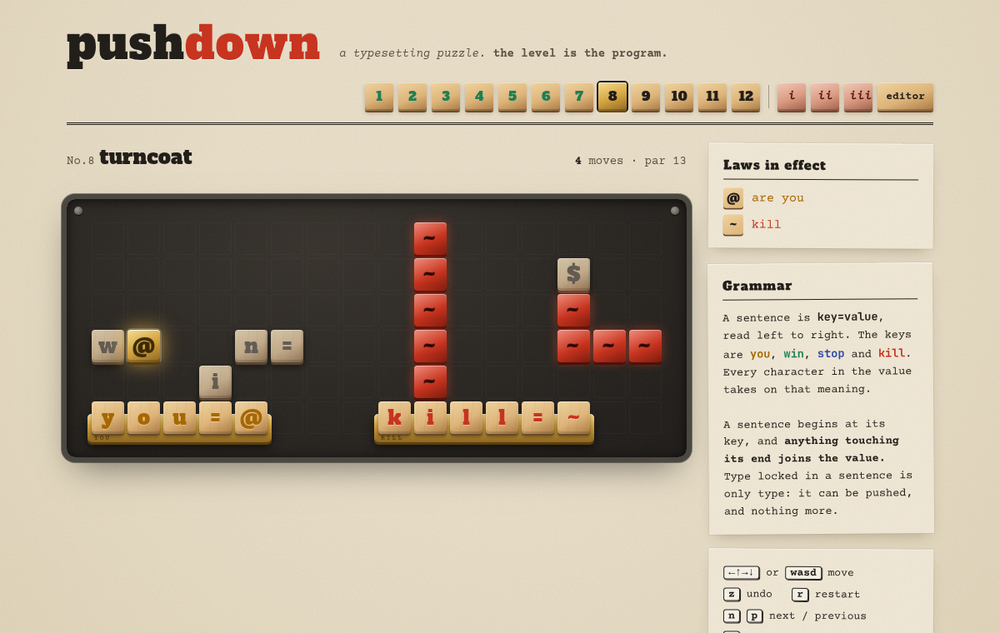

# pushdown

**A typesetting puzzle. The level is the program.**



Open `pushdown.html` in a browser. It's one self-contained file with fonts, engine and levels inlined, and it works offline.

```
  @       $          the board is plain text.
                     `you=@` is a sentence, and so is `win=$`.
you=@   win=$        push the letters around and you rewrite the physics.
```

## The rules

- A **sentence** is `key=value`, read left to right. The keys are `you`, `win`, `stop` and `kill`.
- Every character in the value gets that property. `you=@x` means every loose `@` *and* every loose `x` is you.
- A sentence starts at its key, so junk *before* the key is ignored. Its value runs to the next space or the next `key=`, so **anything touching the end of a sentence joins it**.
- Characters inside a sentence are *type*: inert, pushable, nothing else. Everything else is an *object* and takes on meaning from the sentences.
- `stop` things can't be pushed, and can't move even if they are also `you`.
- **Book II** adds a fifth key, `read`. While any *row* says `read=v`, columns are read top to bottom as well, and the board becomes a crossword: one letter can serve two sentences, and whatever touches the *bottom* of a column joins it. Reading is a law like any other, so it can be broken and restored. (Only rows can turn columns on, so a vertical `read=v` can't sustain itself.)
- Walk into a `win` object, or be `you` and `win` at once, and you win. Walk into `kill` and that body is gone. If no loose character answers to `you` any more, you are no one (press `z`).

## What's in the box

| file | what |
|---|---|
| `pushdown.html` | **the game.** Built artifact, committed so it's ready to play. |
| `engine.js` | parser, step function and BFS solver (~150 lines, no dependencies) |
| `levels.js` | 13 levels in Book I, 6 in Book II (columns), 3 *apocrypha*, as plain strings |
| `par.js` | par = the solver's proven optimum, or a hand-written solution verified by replay (shown as "par ≤ n") |
| `src/game.html` | the page template: letterpress art, sound, editor |
| `build.js` | solves every level, records its par, inlines everything into `pushdown.html` |
| `check.js` | `node check.js [n] [-v]`: solve levels, print par and state counts |
| `trace.js` | `node trace.js n`: print the solver's solution frame by frame |
| `e2e.js` | plays every level in headless Chrome through real key presses, plus an editor round-trip |
| `miner.js` | the level miner: random boards → solver → ranked by how often the laws change |
| `drafts/` | candidate levels and scratch tools |

```sh
node build.js          # verify + rebuild pushdown.html
node check.js -v       # every level, with solutions
node trace.js 4        # watch the solver solve "glue"
node miner.js 120 12   # mine for 2 minutes on 12 cores → drafts/mined.json
MODE=tiny node miner.js 120 12   # minimalist boards → drafts/mined-tiny.json
FILE=./mined-tiny.json node drafts/show.js 0 1 2   # view finds at the moments the laws change
PUPPETEER_DIR=/path/to/node_modules node e2e.js   # needs puppeteer-core + chromium
```

The in-game **editor** lets you type a level, play it, ask the solver whether it's possible, and copy a share link (the level is stored in the URL hash).

## Design notes: the solver as a co-designer

Every level is checked by a breadth-first solver before it ships, and the par shown in-game is the solver's shortest solution. The solver turned out to be the best playtester in the project. Most of the rules exist because it broke an earlier version:

1. **Glue was found, not designed.** The first "fill in the blank" level expected you to push a `$` into `win=`. The solver pushed `win=` into a wall instead, making `win=#` so every wall became a finish line. That became the core idea of the game: *whatever touches the end of a sentence joins it*.
2. **Walking up to a rule used to delete you.** Originally a sentence had to fill its whole run, so `@you=@` (you standing next to the `y`) was nonsense and broke the rule you were standing next to. Sentences now start at their key.
3. **Sentences used to eat each other.** `you=@x` touching `stop=#` became `you=@xstop=#`: you became the walls *and* the walls stopped being solid, in one move. That trick solved almost every level. Now a value ends where the next `key=` begins, so `you=@win=$` is two sentences.
4. **Solid means immovable.** The solver kept winning by gluing `#` onto `you=@` and marching the walls onto the goal. Now `stop` beats `you`. To become the walls, you first have to make them not solid.

Some things the grammar implies that I didn't plan:
- You can never push a character *leftward* into the end of a sentence without joining it yourself, because you end up touching the end too.
- Pushing the last letter out of a sentence vertically puts *you* in its place. You become the new last letter.
- Breaking a sentence frees its letters as live objects. Break a second `you=@` and its `@` wakes up as a new body, wherever it was ("spare body").

## Book II and the limits of brute force

Columns multiply the state space. The Book II finale, *while nobody reads*, asks you to switch reading off (so the river stops being deadly), rearrange the river into a door while nobody's reading, then switch reading back on (so the goal starts counting as a win) and walk through. Its 25-move solution is too deep for breadth-first search: the solver gives up after millions of positions. So a level may carry a hand-written `solution`. The build replays it to prove the level is winnable, and the game shows its par as **≤ 25**. If you beat it, the proof sheet tells you that you found something the solver never did.

The solver itself was rewritten along the way. States are kept in one array in BFS order, so each layer is a contiguous range and parent pointers are typed-array indices. Positions where nobody is `you` are pruned. It now handles millions of states in a few GB.

## Apocrypha: levels nobody designed

`miner.js` generates random boards from puzzle-shaped templates, solves each one, and scores it. The first scoring rule (count how many times the laws change along the shortest solution) found boards that were technically deep and humanly meaningless: Rube Goldberg chains like `you==@=` → `win=tp#`. Rewarding **tiny boards with few pieces and long solutions** worked much better. That's the old Sokoban-minimalism instinct.

The three apocrypha after level 12 came out of that minimalist run. One of them, *exchange*, is a working version of the "abdication" finale I failed to build by hand: you shuffle the identity back and forth between `you=x@` and `you=@@` until a loose `@` is both you and win. The game presents them honestly: no one designed them, so there's no intended solution, only the solver's proof that one exists.

## Art direction

Letterpress. The board is the iron bed of a press, and every character is a block of wooden type that slides when pushed. A live sentence sits in a brass composing stick, inked by what it means: ochre for you, viridian for win, ultramarine for stop, vermilion for kill. You are cast in brass, solid things are lead, and deadly things are red lacquer. Solving a level pulls a paper proof of the final bed. Sounds (wood knocks, a bell when a sentence forms, the press coming down) are synthesized with Web Audio. Type is Alfa Slab One and Courier Prime (both SIL OFL), vendored in `fonts/` and inlined at build time.

## Ideas not yet done

- Better miner taste: penalize solutions whose law changes cancel out (break a rule, re-form the same rule), and reward boards where the *obvious* first move is a trap.
- Vertical sentences (read top to bottom), which would make every letter a potential crossword.
- More keys: `push`, `swap`, `sink`, or `is`, which would let a sentence rename a character.
- A *designed* finale built on "abdication". The miner found a version (apocrypha i), but a hand-made one that teaches it cleanly would be better.
